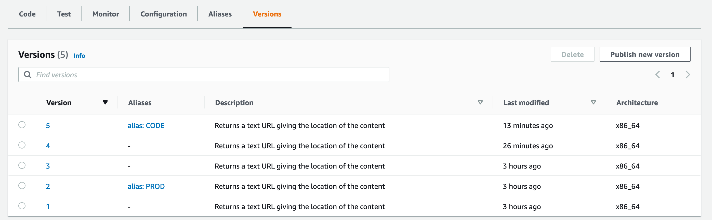

# Multimedia encodings referencing endpoints

This is a re-implementation of the encodings endpoints, based on Go and API Gateway instead of PHP.

## What's in the box?

Main pieces:
- **referenceapi/** - the `reference` endpoint. This looks up the content and gives the result as a single line of text
- **migration/** - a commandline tool (NOT a lambda function!) to migrate data from MySQL into DynamoDB

Other bits:
- common/ - functionality that is shared between all the endpoints. This is the code that does the actual database scanning
- infra/  - Cloudformation deployments to make it all work

## Where is the CODE/PROD cloudformation?

See "Development Updates" below

## Development Prerequisites

You will need:
- A recent version of Go, at least 1.11 but preferably 1.16 or 1.17
- GNU make - this is normally available as standard on Mac or Linux and can be installed (usually via Cygwin) on Windows
- The `jq` utility. Install this with your package manager or Homebrew
- The AWS commandline tools, with working access credentials.

To make sure everything is working, go to the root of this repository in your terminal and run:
```bash
make test
```

## First-time setup

The process of performing a first-time deployment must be done in the right order, otherwise steps will fail because
dependencies from previous steps are not there

0. Make sure you have "Development Prerequisites", above
1. Make sure you have a writable bucket to put the compiled lambda functions into
2. Decide on the `App`, `Stack` and `Stage` identifiers you will use (`Stage` must be `PROD` or `CODE`. Our convention
is that `PROD` indicates the active version and `CODE` the staging/testing version)
3. In a terminal, set these as environment variables:
```bash
declare -x DEPLOYMENTBUCKET=your-deployment-bucket
declare -x APP=encodings-endpoint #or whatever you decide
declare -x STACK=multimedia       #or whatever you decide
declare -x UPLOADVERSION=main     #this is the default value that the cloudformation looks at for initial deployment
```
5. Run `make upload` from the root of this repository. This will compile and upload the lambda function code.
6. Now run `unset UPLOADVERSION`. This will ensure that subsequent zip file revisions are kept seperate by auto-generating
a UUID for the upload path.
7. In the AWS Web console, go to Cloudformation and Create Stack
8. Use the file `infra/apigateway_base.yaml`.  When deploying, make a note of the name you choose; you'll need it later.
Make sure you use the same `App` and `Stack` tags that you used earlier.  This will set up the basic, shared API Gateway setup.
9. With `apigateway_base.yaml` set up, then deploy `infra/endpoints.yaml`.  Use the stack name that you chose for
`apigateway_base` as the `APIGatewayStack` parameter and make sure that the deployment bucket, app, stack and stage
parameters are EXACTLY the ones you used for upload (these values are used to compute the path to the code bundle).
If you don't get the parameters right, it won't deploy.

With this in place, you can go to the API Gateway app in the AWS Console and test the API that way. You can also
retrieve a "direct access" url.

## Where do I find the logs?

## Development process

TL;DR :-

1. Create a Deployment Stage with your name on it in the API Gateway web console
2. Ensure that the stage variable called `stage` is set to the name of the Deployment stage
3. Set `STAGE` to this value in an environment variable in your terminal and run `make clean && make deploy`
4. Use the API Gateway web console to find the test URL to call
5. Deploy to CODE and PROD via CI

### Versioning and staging
The details of how staging works in this project are somewhat different to how most other GNM projects work, so please
spend a few moments to read this and get used to them.

Instead of having a PROD lambda function and a CODE lambda function for each endpoint as completely seperate entities,
there is only one lambda function for each endpoint.  This lambda function has a number of _versions_ (see
https://docs.aws.amazon.com/lambda/latest/dg/configuration-versions.html) and an _alias_ (see 
https://docs.aws.amazon.com/lambda/latest/dg/configuration-aliases.html) for each deployment stage.

Each time you run `make deploy` or `make upload`, the following operations are done:
- The current source code is compiled and compressed into a zip
- This zip is uploaded to S3
- If `make upload` is being run then the process stops here
- The lambda function is updated with the location of the new zipfile
- A version of the lambda is created with the `publish` operation. This version is identified by a monotonically
increasing number, and can be seen in the Lambda console by selecting the function in question and then going to the
"Versions" tab about halfway down the screen
- Note that the version number does not _necessarily_ increase on every update.  When the upload is made, an SHA checksum
is performed on the zip. If this matches a previous version, then rather than a new iteration being created the number
of the version with a matching SHA checksum is returned instead
- If the `STAGE` environment variable is set, an alias with the name of `STAGE` is then associated with this version, if
it exists.

This screenshot should help explain the way that this works:


You can see that there are five versions of this lambda function in existence. Version
5 is associated with `CODE` and version 2 is associated with `PROD`.

The "alias" is just a label, and can be easily adjusted in "Aliases" tab of the Lambda console or via the commandline.
See the `ci-scripts/lambda-version.sh` file for an example of how this works.

- `make upload` will only upload the newly compiled code and not associate it with a lambda. Use this for initial setup
- `make deploy` will upload the newly compiled code and create a lambda version associated with it
- `make deploy` will also link that version to a deployment stage _if_ the `STAGE` environment variable is set

### Deployment stages

So, how do these "alias" labels actually tell the system what code should be accessed from a given endpoint?

The answer is in the API Gateway configuration.

API Gateway has the concept of deployment stages.  By default, these are accessed as a subpath of a single domain but
can be mapped to their own domain names (see "Proper DNS Names", below).  A given REST API can have as many deployment
stages as you want, with whatever names you want, and this can be configured through the web console.  In order for an 
endpoint to be called, it must be associated with a deployment stage.

The cloudformation here provides two stages - `CODE` and `PROD`.  A deployment stage has its own arbitary metadata keys
which are passed to code when it is run, called "Stage Variables".  Our stages here have a single stage variable called `stage`
which is simply equal to the name of the deployment stage - either `CODE` or `PROD`.

The lambda function is associated with the REST API by way of a `AWS::ApiGateway::Method`.  This tells API Gateway
what it should execute and how as well as what subpath it should correspond to (via a link to a `AWS::ApiGateway::Resource`).

The `AWS::ApiGateway::Method` is _not_ directly associated with a deployment stage.  In the configuration, the lambda
function to invoke is specified in a horribly roundabout way through a custom URI construct that looks something like
this:

```
!Sub arn:aws:apigateway:${AWS::Region}:lambda:path/2015-03-31/functions/arn:aws:lambda:${AWS::Region}:${AWS::AccountId}:function:${ReferenceAPI}:${!stageVariables.stage}/invocations
```

(It is a partial URL consisting of two ARNs sandwiched together with a verb on the end)

The key thing here is the extra parameter on the end of the lambda function ARN:

```
arn:aws:lambda:${AWS::Region}:${AWS::AccountId}:function:${ReferenceAPI}:${!stageVariables.stage}
```

This last : separated parameter gives the _version_ or _alias_ of the lambda function to invoke.  Here, we take the value
of the `stage` "Stage Variable" (set to either `PROD` or `CODE`, as above) and use it as the _alias_ name of the function
to invoke.

Therefore, the `PROD` deployment stage will invoke the lambda function version with the alias `PROD` and the `CODE` deployment
stage will invoke the lambda function with the alias `CODE`.  You could even create a deployment stage called
`Sausages` and it would try to invoke the lambda function version with an alias `Sausages` (and would fail, unless you
had created it first).

In this way, you can release to CODE simply by setting the environment variable `STAGE=CODE` on your terminal and running
`make deploy`.  That would build the code, upload it, create a function version and associate the alias `CODE` with it and
cause the CODE deployment stage of the API to invoke your updated function the next time it is called.

Technically you can release to PROD in the same way, but I wouldn't recommend it - it's better practise to use a proper
CI workflow (and usually a Canary too)

### What the hell is a Canary?

For full details, see here: https://docs.aws.amazon.com/apigateway/latest/developerguide/canary-release.html

Briefly, a Canary is like a _proposed_ change to a deployment stage.  For example, say we have version 321 which we want
to deploy to PROD.  We could just change the PROD alias to point to version 321 (in the Lambda console), but what if
there is a bug in 321? We would then have a complete outage until the change is reverted.

Instead, we can create a Canary on the PROD deployment stage via the API Gateway console.  This allows us to override the
calling version _directly_ to 321 and have that called for _only a small percentage of requests_.  This means that we
can still pick up any errors by looking at metrics, logs and alerts but only a small number of requests will be inconvenienced
if there is a bug.  An inconvenienced user should be able to fix an issue just by reloading a couple of times.

Once we are satisfied that the Canary deploy is working we can either delete the canary and update the alias or "Promote"
the canary which will overwrite the config for the PROD stage with the Canary's config.

### CI Integration

Not done yet

## Proper DNS names

TODO
